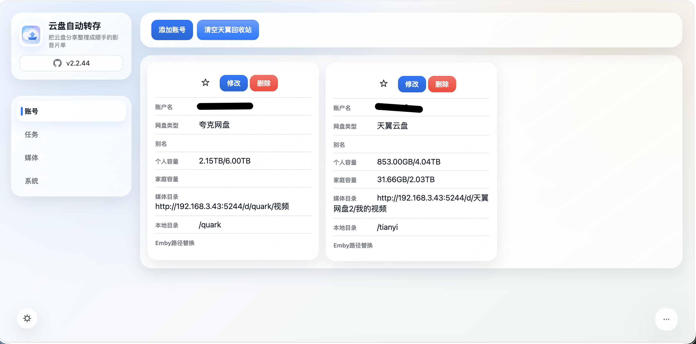
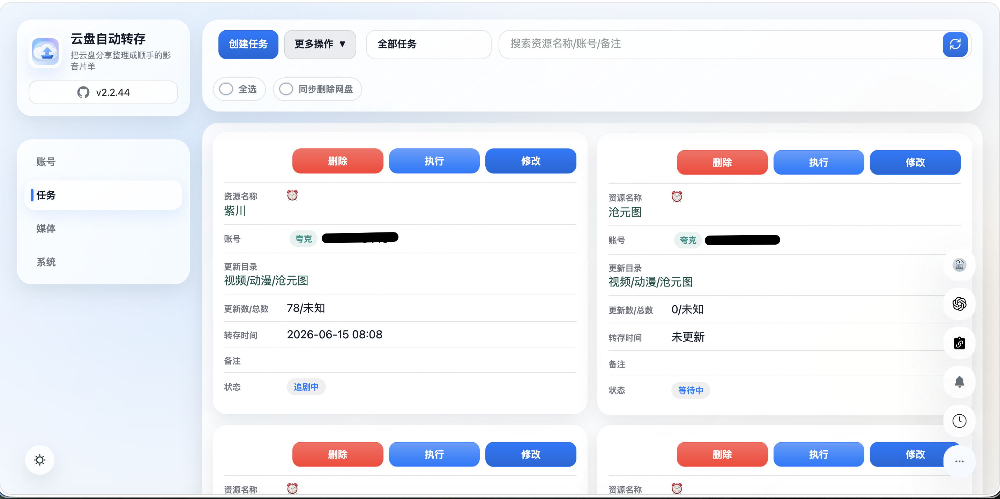
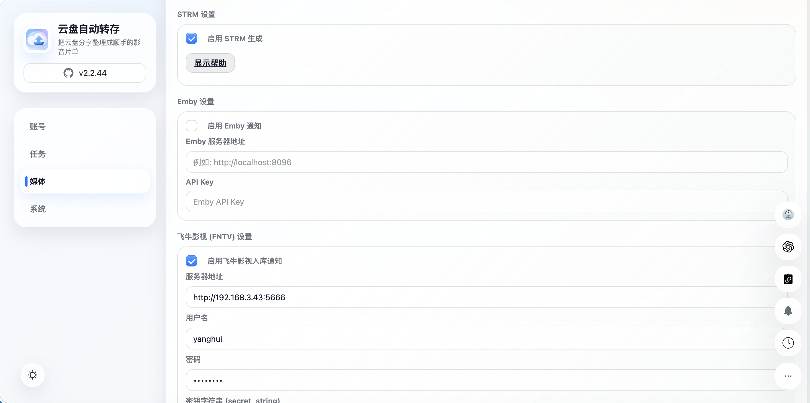
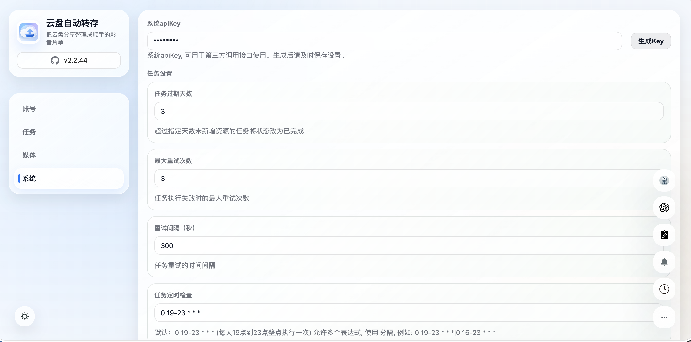
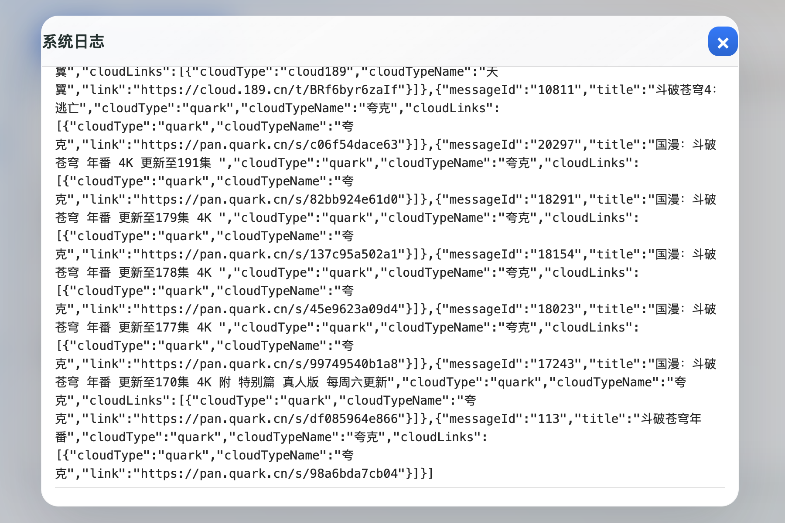

# Cloud Auto Save

天翼云盘、夸克网盘自动转存与媒体库联动工具。

本项目 fork 自 [1307super/cloud189-auto-save](https://github.com/1307super/cloud189-auto-save)，在原有天翼云盘自动转存能力上扩展了夸克网盘、STRM、媒体刮削、AI 重命名、SmartStrm、飞牛影视、Telegram Bot 等功能。

## 功能特性

### 网盘与任务

- 支持天翼云盘、夸克网盘账号。
- 天翼云盘支持账号密码、Cookie、扫码登录。
- 夸克网盘使用 Cookie 登录。
- 自动识别天翼云盘、夸克网盘分享链接。
- 支持分享链接访问码、分享目录选择、单文件分享。
- 支持任务手动执行、全部执行、自定义 Cron 定时执行。
- 支持增量转存，只转存目标目录中不存在的文件。
- 支持文件名正则匹配、集数筛选、包含/不包含过滤。
- 支持只保存媒体文件，可自定义媒体后缀。
- 支持任务失败自动重试、重试间隔配置。
- 天翼云盘支持自动清空个人/家庭回收站。
- 支持目标目录失效后自动重建。
- 夸克网盘支持分享 `stoken` 过期后自动刷新并重试。

### 媒体能力

- 支持生成 STRM 文件。
- 支持按账号配置本地 STRM 路径、媒体库访问路径、Emby 路径替换。
- 支持 OpenList/Alist 签名链接校验与缓存刷新。
- 支持 TMDB 刮削。
- 支持 OpenAI 兼容接口进行资源识别和 AI 重命名。
- 支持任务完成后通知 Emby 刷新媒体库。
- 支持任务完成后通知飞牛影视刷新指定媒体库。
- 支持任务完成后触发 SmartStrm Webhook。

### 通知与自动化

- 支持企业微信机器人、Telegram、WxPusher、Bark、PushPlus。
- 支持自定义推送，可配置请求方法、URL、请求头和模板。
- 支持 Telegram Bot 直接发送分享链接创建任务。
- 支持 CloudSaver 对接。
- 支持按服务配置代理：Telegram、TMDB、OpenAI、夸克网盘、自定义推送。

### 管理界面

- Web UI 管理账号、任务、目录、日志、媒体设置和系统设置。
- 支持账号容量查看、常用目录保存。
- 支持任务编辑、批量删除、删除任务时同步删除云盘文件。
- 支持文件列表查看、手动重命名、AI 重命名。
- 支持实时日志查看。

## 界面预览

| 页面 | 截图 |
| --- | --- |
| 账号管理 |  |
| 任务管理 |  |
| 媒体设置 |  |
| 系统设置 |  |
| 日志 |  |

## 快速部署

### Docker

```bash
docker run -d \
  --name cloud-auto-save \
  --restart unless-stopped \
  -p 3000:3000 \
  -v /vol2/1000/docker/cloud-auto-save:/home/data \
  -v /vol1/1000/link/cloud:/home/strm \
  -e PUID=0 \
  -e PGID=0 \
  yahoj/cloud-auto-save
```

访问：

```text
http://服务器IP:3000
```

默认登录账号：

```text
用户名：admin
密码：admin
```

首次登录后请立即在“系统设置”中修改默认账号密码。

### Docker Compose

```yaml
services:
  cloud-auto-save:
    image: yahoj/cloud-auto-save
    container_name: cloud-auto-save
    restart: unless-stopped
    ports:
      - "3000:3000"
    environment:
      TZ: Asia/Shanghai
      PUID: 0
      PGID: 0
    volumes:
      - /vol2/1000/docker/cloud-auto-save:/home/data
      - /vol1/1000/link/cloud:/home/strm
```

### 源码运行

```bash
yarn install
yarn build
yarn start
```

开发模式：

```bash
yarn dev
```

类型检查：

```bash
yarn test
```

## 目录说明

Docker 容器内主要目录：

| 路径 | 说明 |
| --- | --- |
| `/home/data` | 数据库、配置、Session、登录 Token |
| `/home/strm` | STRM 输出目录 |

建议升级前备份 `/home/data`。

## 环境变量

| 变量 | 说明 | 默认值 |
| --- | --- | --- |
| `TZ` | 容器时区 | `Asia/Shanghai` |
| `PUID` | STRM 文件属主 UID | `0` |
| `PGID` | STRM 文件属组 GID | `0` |
| `STRM_DIR_MODE` | STRM 目录权限 | `775` |
| `STRM_FILE_MODE` | STRM 文件权限 | `664` |
| `SESSION_SECRET` | Session 密钥 | 自动生成并写入配置 |
| `CORS_ORIGINS` | 允许跨域来源，多个用英文逗号分隔 | 空 |
| `TYPEORM_SYNC` | 是否启用数据库结构同步 | 生产环境默认关闭 |

## 基本使用流程

1. 登录 Web UI。
2. 在“账号管理”中添加天翼云盘或夸克网盘账号。
3. 配置账号的媒体路径：
   - 媒体目录：媒体服务访问云盘时使用的路径。
   - 本地目录：本系统生成 STRM 文件时使用的本地路径。
   - Emby 路径替换：Emby Webhook 删除 STRM 时用于路径映射。
4. 在“任务管理”中粘贴分享链接。
5. 选择账号、分享目录、保存目录、筛选规则和定时规则。
6. 创建任务后手动执行，或等待定时任务执行。
7. 如启用 STRM、刮削、通知服务，任务完成后会自动触发后置流程。

## 任务设置

可在“系统设置”中调整：

| 配置 | 说明 |
| --- | --- |
| 任务检查 Cron | 全局任务执行计划 |
| 回收站清理 Cron | 自动清理天翼云盘回收站计划 |
| 最大重试次数 | 任务失败后的最大重试次数 |
| 重试间隔 | 任务失败后的重试等待时间，单位秒 |
| 任务过期天数 | 处理中的任务长时间无新增后标记完成 |
| 媒体文件后缀 | 只保存媒体文件时使用 |
| 只保存媒体文件 | 开启后非媒体后缀文件不会转存 |
| 自动重建目录 | 目标目录不存在时自动重新创建 |
| 自动清空回收站 | 定时清空天翼云盘个人或家庭回收站 |

## 账号配置

### 天翼云盘

支持三种方式：

- 用户名 + 密码。
- Cookie。
- 扫码登录。

如果账号需要验证码，页面会提示输入验证码。

### 夸克网盘

夸克网盘使用 Cookie 登录。添加账号时选择“夸克网盘”，填写 Cookie 后保存。

夸克分享任务会在 `stoken` 过期时自动重新获取并重试。若 Cookie 本身失效，需要重新更新账号 Cookie。

## STRM 与媒体库

启用 STRM 后，任务完成时会在 `/home/strm` 下生成 `.strm` 文件。

每个账号需要配置：

| 字段 | 说明 |
| --- | --- |
| 媒体目录 | STRM 内容中写入的媒体访问路径，例如 OpenList/Alist 的 `/d/云盘` 路径 |
| 本地目录 | STRM 文件输出时对应的本地路径 |
| Emby 路径替换 | Emby 删除事件回调时用于定位本地 STRM 文件 |

常见组合：

```text
容器挂载：
/vol1/1000/link/cloud:/home/strm

本地目录：
/home/strm

媒体目录：
http://alist:5244/d/云盘
```

如果媒体目录指向 OpenList-CAS，`.mkv.cas`、`.mp4.cas` 等 CAS 文件会生成 `文件名.(mkv).strm`、`文件名.(mp4).strm`，STRM 内容会追加 `type=cas_video` 以触发 OpenList-CAS 的临时恢复播放。

## OpenList/Alist

配置位置：媒体设置。

| 配置 | 说明 |
| --- | --- |
| 服务器地址 | OpenList/Alist 访问地址 |
| API Key | OpenList/Alist API Key |

用途：

- STRM 内容生成。
- 校验已有 STRM 是否仍可访问。
- 任务完成后刷新目录缓存。

## Emby

配置位置：媒体设置。

| 配置 | 说明 |
| --- | --- |
| 服务器地址 | Emby 服务地址 |
| API Key | Emby API Key |

Webhook 地址：

```text
http://本系统地址/emby/notify
```

Emby 删除媒体时，本系统可根据路径映射删除对应 STRM 文件。

## TMDB 与 AI

### TMDB

启用 TMDB 刮削后，系统会尝试识别影视信息，并补充任务的媒体信息。

配置：

- 启用刮削。
- TMDB API Key。

### OpenAI 兼容接口

用于：

- 资源名分析。
- 文件过滤辅助。
- AI 重命名。
- 生成更规范的剧集或电影文件名。

配置：

| 配置 | 说明 |
| --- | --- |
| Base URL | OpenAI 兼容接口地址 |
| API Key | 接口密钥 |
| Model | 模型名称 |
| 剧集模板 | 默认 `{name} - {se}{ext}` |
| 电影模板 | 默认 `{name} ({year}){ext}` |

## 飞牛影视

配置位置：媒体设置。

任务完成、AI 重命名、STRM 生成等后置流程结束后，可自动通知飞牛影视刷新媒体库。

配置项：

| 配置 | 说明 |
| --- | --- |
| 服务器地址 | 飞牛影视地址，例如 `http://10.0.0.6:5666` |
| 用户名 / 密码 | 飞牛影视账号 |
| `secret_string` | 飞牛影视 API 签名密钥字符串 |
| API Key | 飞牛影视 API Key |
| 媒体库映射 | 根据任务路径或资源名匹配媒体库 |

媒体库映射格式：

```text
动漫:动漫
电影:电影
剧集:电视剧
```

也支持用分号分隔：

```text
动漫:动漫;电影:电影
```

当任务路径或资源名包含左侧关键字时，会刷新右侧媒体库。

## SmartStrm

配置位置：系统设置。

任务完成并执行完后置处理后，可触发 SmartStrm Webhook。

配置项：

| 配置 | 说明 |
| --- | --- |
| Webhook URL | SmartStrm 接收地址 |
| 任务映射 | 将本系统资源名映射为 SmartStrm 任务名 |

任务映射格式：

```text
动漫:tianyi_动漫
电影:tianyi_电影
```

当转存路径或资源名包含 `动漫` 时，会使用 `tianyi_动漫` 作为 SmartStrm 任务名。

## 通知服务

支持：

- 企业微信机器人。
- Telegram。
- WxPusher。
- Bark。
- PushPlus。
- 自定义推送。

自定义推送适合对接 Server 酱、自建 Webhook、消息网关等服务。

## Telegram Bot

配置位置：系统设置。

启用后可以在 Telegram 中发送天翼云盘或夸克网盘分享链接，按交互流程选择账号、目录并创建任务。

需要配置：

- Bot Token。
- Chat ID。

如网络环境需要代理，可在代理设置中启用 Telegram 代理。

## 代理设置

支持为以下服务启用代理：

- Telegram。
- TMDB。
- OpenAI。
- 夸克网盘。
- 自定义推送。

代理配置包含：

- Host。
- Port。
- Username。
- Password。

## CloudSaver 对接

配置位置：媒体设置。

可配置 CloudSaver 的：

- Base URL。
- 用户名。
- 密码。

当相关配置变化时，系统会清理本地 CloudSaver Token 缓存。

## API

API 请求需要携带：

```http
x-api-key: 你的 API Key
```

API Key 可在系统设置中生成。

常用接口：

| 方法 | 路径 | 说明 |
| --- | --- | --- |
| `GET` | `/api/accounts` | 获取账号列表 |
| `POST` | `/api/accounts` | 新增或更新账号 |
| `GET` | `/api/tasks` | 获取任务列表 |
| `POST` | `/api/tasks` | 创建任务 |
| `PUT` | `/api/tasks/:id` | 更新任务 |
| `DELETE` | `/api/tasks/:id` | 删除任务 |
| `POST` | `/api/tasks/:id/execute` | 执行单个任务 |
| `POST` | `/api/tasks/executeAll` | 执行全部任务 |
| `POST` | `/api/share/parse` | 解析分享链接目录 |
| `GET` | `/api/folders/:accountId` | 获取网盘目录 |
| `POST` | `/api/folders/:accountId` | 创建网盘目录 |
| `GET` | `/api/favorites/:accountId` | 获取常用目录 |
| `POST` | `/api/saveFavorites` | 保存常用目录 |
| `POST` | `/api/tasks/strm` | 按任务生成 STRM |
| `POST` | `/api/strm/generate-all` | 批量生成 STRM |
| `GET` | `/api/settings` | 获取系统设置 |
| `POST` | `/api/settings` | 保存系统设置 |
| `POST` | `/api/settings/media` | 保存媒体设置 |
| `POST` | `/api/files/rename` | 手动重命名 |
| `POST` | `/api/files/ai-rename` | AI 重命名 |
| `POST` | `/api/custom-push/test` | 测试自定义推送 |

更多接口说明见 [doc/api.md](doc/api.md)。

## 安全建议

- 首次部署后立即修改默认账号密码。
- 设置 API Key 后妥善保存，不要公开到前端页面、日志或仓库。
- 不要把 `/home/data` 暴露为静态目录。
- Cookie、Token、API Key 都保存在 `/home/data/config.json` 或账号数据中，请做好权限控制。
- 生产环境不建议开启 `TYPEORM_SYNC=true`。
- 反向代理部署时建议启用 HTTPS。

## 常见问题

### 夸克分享链接浏览器能打开，但任务报 `分享的stoken过期`

浏览器打开分享链接会由夸克网页重新处理登录态和 Token；任务执行走的是接口，历史任务里保存的 `stoken` 可能过期。

当前版本会在遇到 `41016` 或 `分享的stoken过期` 时自动刷新 `stoken` 并重试一次。如果仍失败，请更新夸克账号 Cookie。

### 任务执行后没有转存任何内容

可能原因：

- 分享目录没有新增文件。
- 目标目录中已经存在同名文件或同名文件夹。
- 开启了“只保存媒体文件”，但分享内容后缀不在媒体后缀列表中。
- 配置了匹配规则，文件名没有命中规则。
- 分享内容仍在审核中或网盘接口返回异常。

日志中会输出源文件数、源目录数和过滤结果，可根据日志定位。

### STRM 已生成但媒体库无法播放

检查：

- 账号的“媒体目录”是否能被播放器或媒体服务访问。
- OpenList/Alist 地址和 API Key 是否正确。
- STRM 文件中的 URL 是否能在媒体服务所在网络访问。
- 文件权限是否符合 NAS 或 Docker 用户要求。

### 天翼云盘登录失效

重新编辑账号，更新密码、Cookie，或使用扫码登录重新登录。

### 夸克账号验证失败

通常是 Cookie 失效或 Cookie 不完整。请重新从浏览器获取夸克网盘 Cookie 后更新账号。

## 开发

```bash
yarn install
yarn dev
```

构建：

```bash
yarn build
```

检查：

```bash
yarn test
```

## License

见 [LICENSE](LICENSE)。
